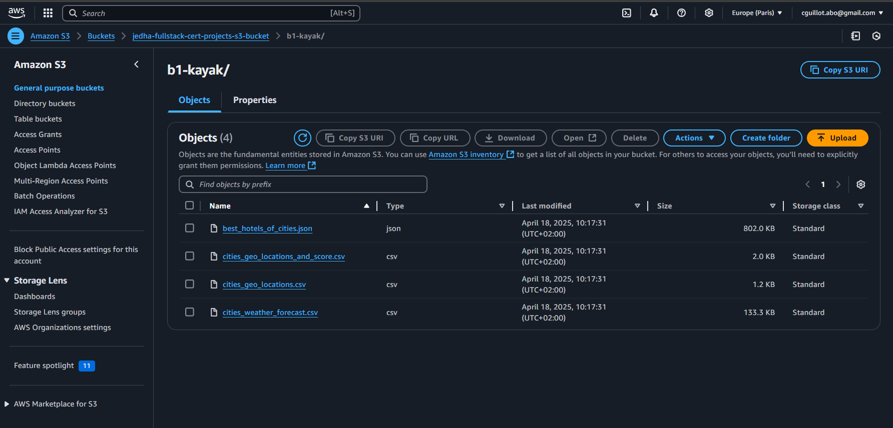
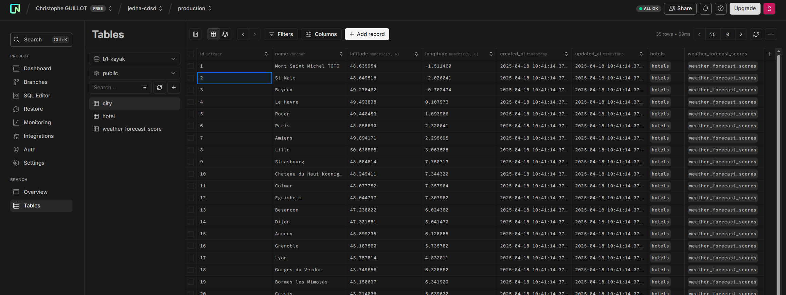
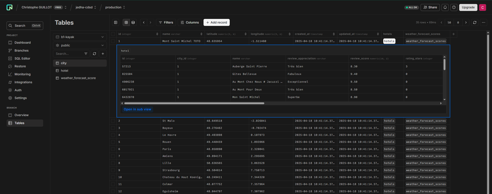
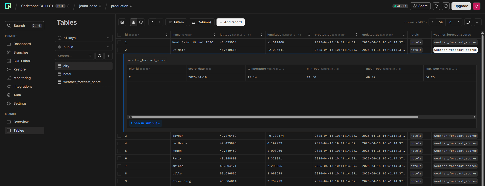
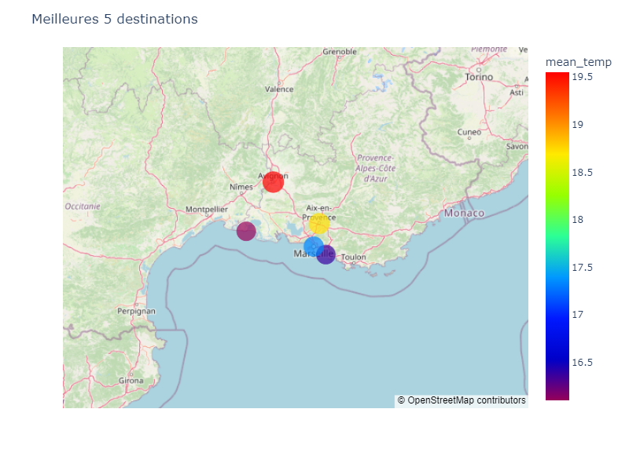
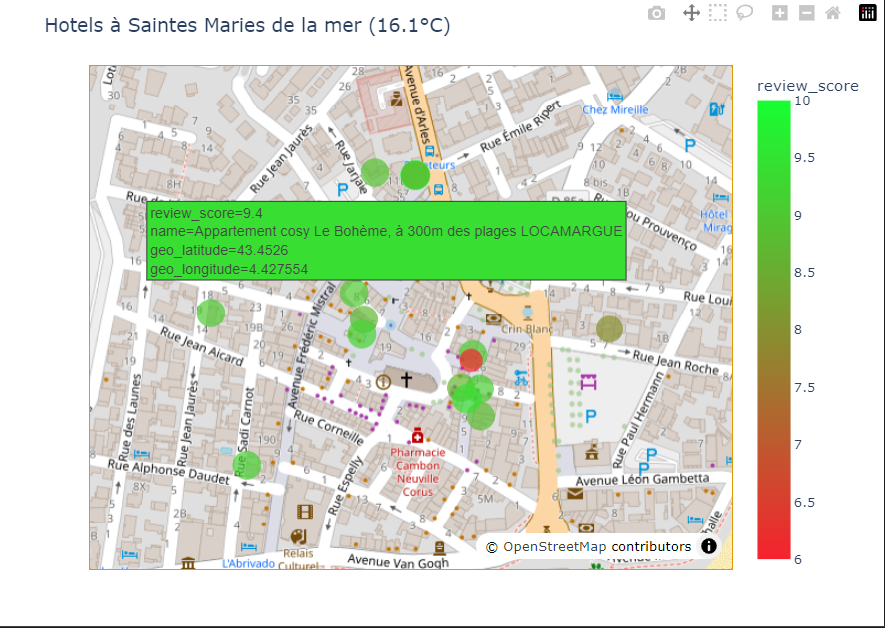

# Projet Kayak

> [Présentation du projet sur Julie (JEDHA)](https://app.jedha.co/course/project-plan-your-trip-with-kayak-ft/plan-your-trip-with-kayak-ft)

## Présentation
### Contexte
L'équipe Marketing a fait deux constats à l’issu d'une étude utilisateur&nbsp;:
- 70 % des utilisateurs qui prévoient un voyage aimeraient plus d'informations sur leur destination.
- Les utilisateurs sont souvent sceptiques face aux contenus non liés à une marque reconnue.

### Demande
L’équipe souhaite donc développer une application de recommandation de destinations de voyage.
A partir de données réelles, l’application recommandera les meilleures destinations et hôtels, en fonction&nbsp;:
- des conditions météorologiques
- de l’offre hôtelière disponible

## Structure du projet

[Powerpoint du projet Kayak](https://1drv.ms/p/c/e238927bf76c9315/ESk1hUCcGpNHh_DvEbOjhbIBD-HpSE8ygiF7FLtBFbhAwg?e=mtGkn8)

Présentation du projet JEDHA&nbsp;:
- [00-JEDHA-Plan_your_trip_with_Kayak.ipynb](00-JEDHA-Plan_your_trip_with_Kayak.ipynb)

Configuration commune du projet&nbsp;:
- [config.py](config.py)&nbsp;: exporte les variables et secrets utilisés par les différents notebooks
- nécessite la mise en place de l'infrastructure commune&nbsp;:
  - [.env](../../.env.sample) à la racine du repository
  - [common infra](../../common/README.md)

Récupération (via l'APIs Nominatim) des coordonnées GPS des villes&nbsp;:
- [01-b1-kayak-destinations.ipynb](01-b1-kayak-destinations.ipynb)
- résultats&nbsp;:
  - [cities_geo_locations.csv](data/cities_geo_locations.csv)&nbsp;: liste des villes avec leurs coordonnées GPS

Récupération (via l'APIs OpenWeather) des prévisions météo des villes&nbsp;:
- [02-b1-kayak-cities-weather-forecast.ipynb](02-b1-kayak-cities-weather-forecast.ipynb)
- [etl.py](etl.py)&nbsp;: fonctions communes utilisées pour la transformation des données météos (ranking)
- résultats&nbsp;:
  - [cities_weather_forecast.csv](data/cities_weather_forecast.csv)&nbsp;: prévisions météo à 5 jours par ville
  - [cities_geo_locations_and_score.csv](data/cities_geo_locations_and_score.csv)&nbsp;: liste des villes avec leurs coordonnées GPS et leur ranking en fonction de la météo à venir

Récupération des meilleurs hotels pour chaque ville&nbsp;:
- [scrapper](scrapper/README.md)&nbsp;: projet scrapy pour le scraping de Booking.com
- [03-b1-kayak-get-hotels.ipynb](03-b1-kayak-get-hotels.ipynb)&nbsp;: invocation du scraper dupuis un notebook
- [utils.py](utils.py)&nbsp;: fonctions utilitaires
- résultats&nbsp;:
  - [best_hotels_of_cities.json](data/best_hotels_of_cities.json)&nbsp;: liste des hotels avec leurs caractéristiques

Stockage vers Amazon S3 et transformation/stockage vers PostgreSQL&nbsp;:
- [04-b1-kayak-etl.ipynb](04-b1-kayak-etl.ipynb)
- [etl.py](etl.py)&nbsp;: fonctions communes utilisées pour la transformation des données météos (ranking)
- [utils.py](utils.py)&nbsp;: fonctions utilitaires
- résultats&nbsp;:
  - 

Génération des cartes de recommendations&nbsp;:
- [05-b1-kayak-viz.ipynb](05-b1-kayak-viz.ipynb)
- [utils.py](utils.py)&nbsp;: fonctions utilitaires
- résultats&nbsp;:
  - table des villes&nbsp;: 
  - table des hotels&nbsp;: 
  - table du ranking des villes&nbsp;: 
  - meilleures 5 destinations&nbsp;: 
  - hotels d'une destination&nbsp;: 
