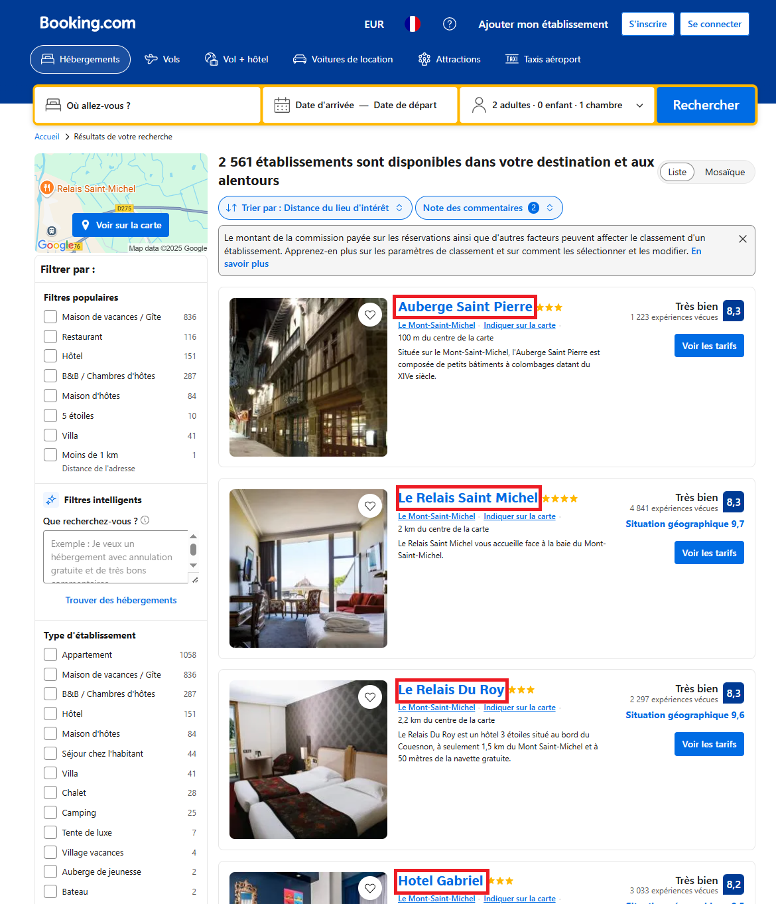
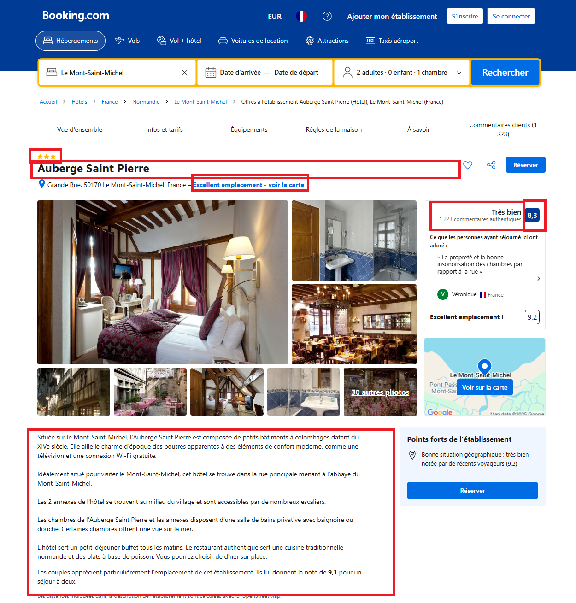

# Web scraper de Booking.com
Implementation basée sur

## Invocation:
```bash
python ./src/scrapper/main.py --city-id '{city_id}' --name '{city_name}' --latitude '{city_latitude}' --longitude '{city_longitude}' --json-store-file-path '{BEST_HOTELS_OF_CITIES_JSON_PATH}'
```

## Booking.com
### Obtention de la liste des hotels pour une ville:



### Obtention des détails de chaque hotel
Certaines informations seront extraites du HTML, d'autre des balises meta du header de la page.



## Code
Point d'entrée:
- [main.py](src/scrapper/main.py)

Définition du scrapy.Spider
- [booking_spider.py](src/scrapper/booking_spider.py)

Définition du pipeline de processing des items
- [booking_pipeline.py](src/scrapper/booking_pipeline.py)

Définition de l'item représentant un hotel
- [booking_items.py](src/scrapper/booking_items.py)

