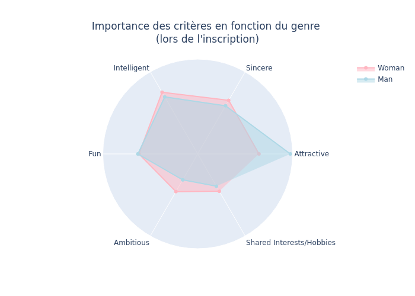
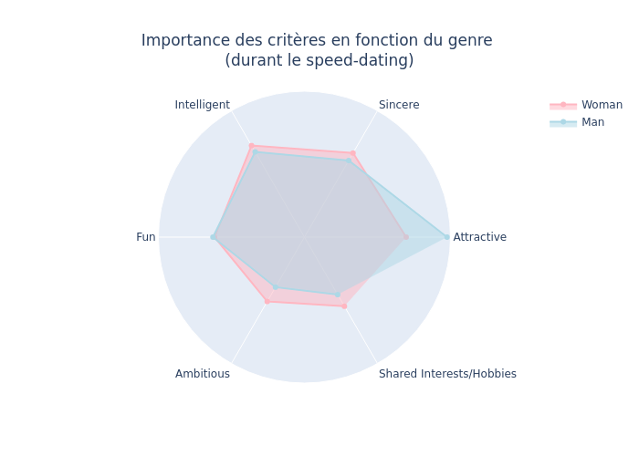
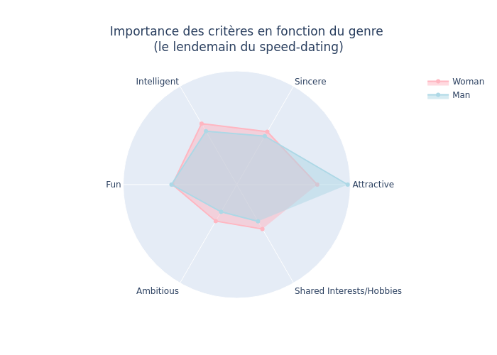
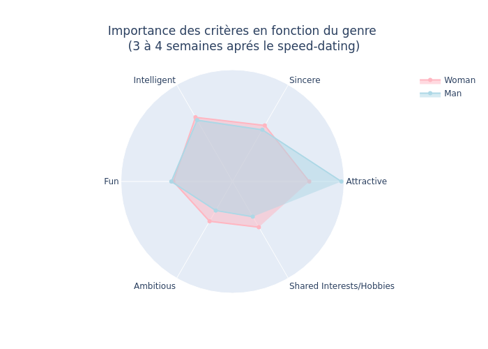
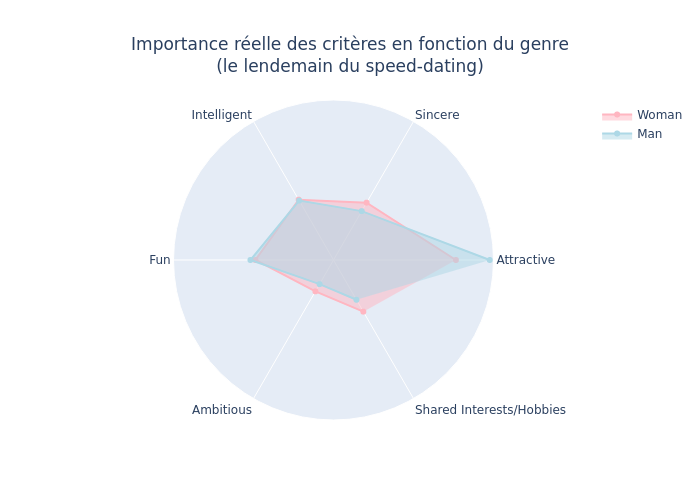
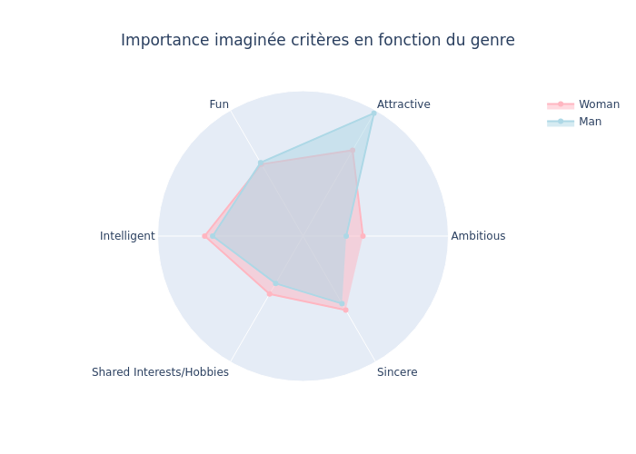
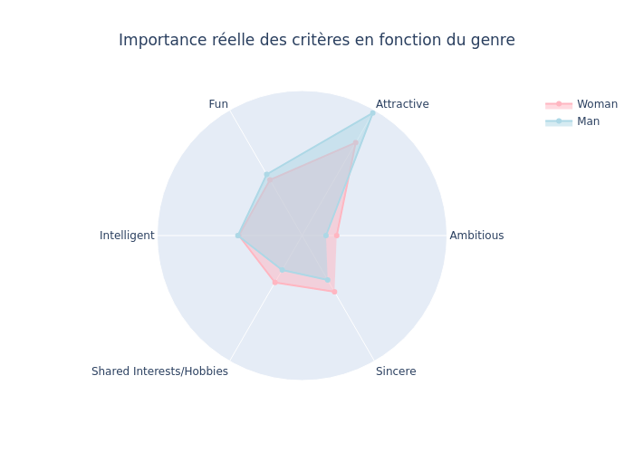
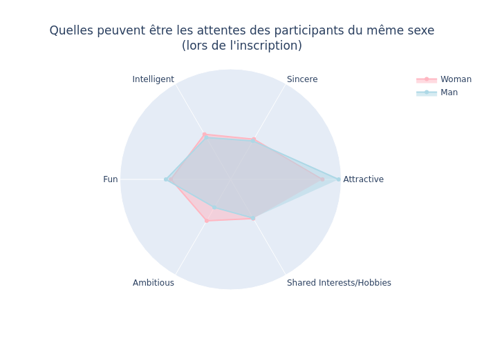
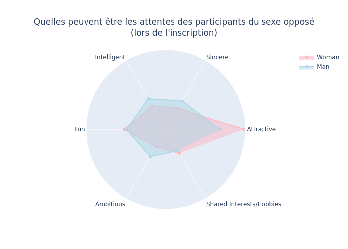

# Projet Speed Dating
## Présentation
### 📇 L’entreprise  
Tinder est une application de rencontres en ligne basée sur la géolocalisation. Les utilisateurs peuvent "swiper à droite" pour indiquer leur intérêt pour une personne, ou "swiper à gauche" pour passer. Chaque profil contient des photos, une courte biographie et une liste d’intérêts.

Lancée en 2012 par Sean Rad lors d’un hackathon organisé par l’incubateur Hatch Labs à West Hollywood, l’application a depuis connu un immense succès, dépassant les 65 milliards de matchs dans le monde en 2021.

### 🚧 Contexte du projet  
L’équipe marketing de Tinder est confrontée à une baisse du nombre de matchs sur l’application. Afin de mieux comprendre ce qui pousse deux personnes à s'intéresser l’une à l’autre, une expérience de speed dating a été mise en place.

Lors de cette expérience, les participants ont partagé de nombreuses informations personnelles susceptibles d’apparaître sur leur profil Tinder. Chaque ligne du jeu de données issu de cette expérience correspond à un rendez-vous entre deux personnes, et indique si chacune d’elles a exprimé le souhait secret de revoir l’autre.

### 🎯 Objectifs du projet  
L’objectif est d’analyser ce jeu de données afin de comprendre les facteurs qui influencent l’attraction mutuelle et la décision de se revoir. Pour cela, nous pourrons utiliser :

- Des statistiques descriptives  
- Des visualisations de données

## EDA: what is it?
L'objectif principal est d'aider à examiner les données avant la formulation d'hypothèses. On pourra l'utiliser pour :
- Identifier les erreurs évidentes,
- Avoir une meilleure compréhension des patterns au sein des données,
- Détecter les événements anormaux ou valeurs aberrantes,
- Trouver les relations intéressantes entre les variables.

## Structure du projet

Présentation du projet JEDHA&nbsp;:
- [00-JEDHA-Speed_Dating.ipynb](00-JEDHA-Speed_Dating.ipynb)
- Notebooks:
  - [01-speed-dating-eda.ipynb](01-speed-dating-eda.ipynb): découverte du dataset
  - [02-speed-dating-eda-data-cleaning.ipynb](02-speed-dating-eda-data-cleaning.ipynb): nettoyage et décoration des données
  - [03-speed-dating-eda-participants.ipynb](03-speed-dating-eda-participants.ipynb): connaissance des participant
  - [04-speed-dating-eda-match.ipynb](04-speed-dating-eda-match.ipynb): relations entre match
- [viz.py](viz.py): fonctions mutualisées pour la visualisation
- [speed_dating_document_context.py](speed_dating_document_context.py): fonctions et définitions relatives aux colonnes de données traitées (listes, noms)

Configuration commune du projet&nbsp;:
- [config.py](config.py)&nbsp;: exporte les variables et secrets utilisés par les différents notebooks
- nécessite la mise en place de l'infrastructure commune&nbsp;:
  - [.env](../../.env.sample) à la racine du repository
  - [common infra](../../common/README.md)

## Viz

Ici un rappel des images présentes dans le notebook mais non rendues par github. Soit plotly est inliné et le notebook explose (> 50 MB) ou on ne voit pas les graph...

