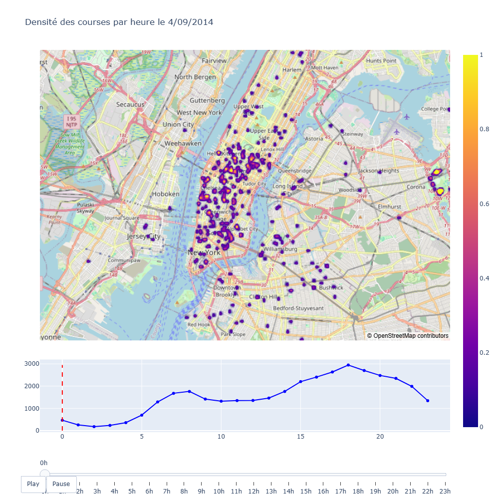
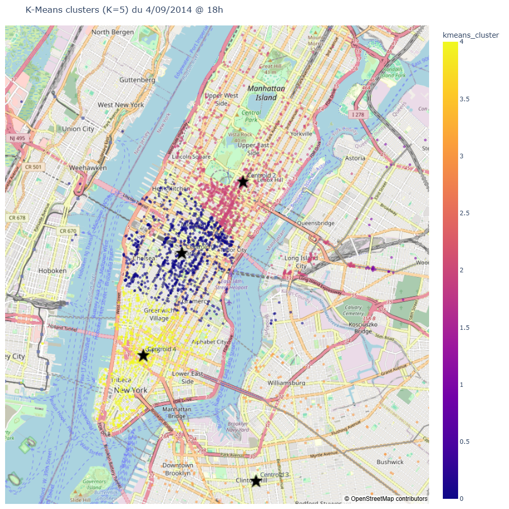
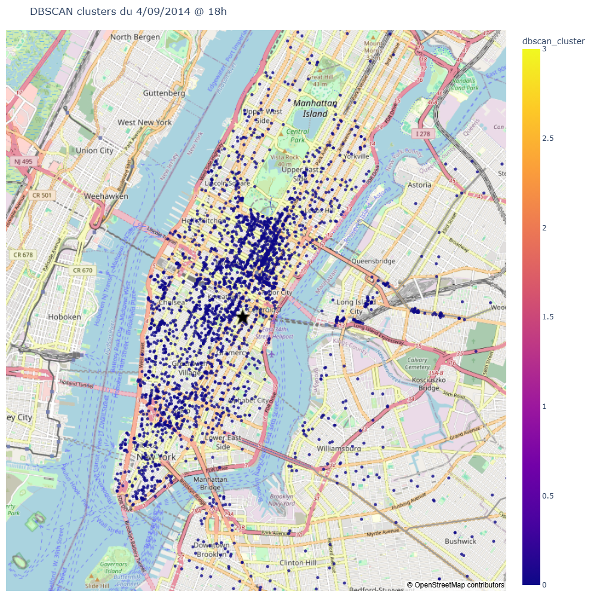
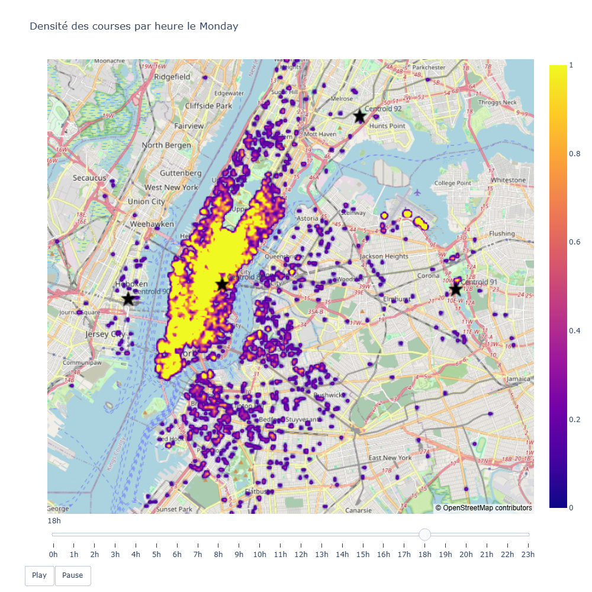
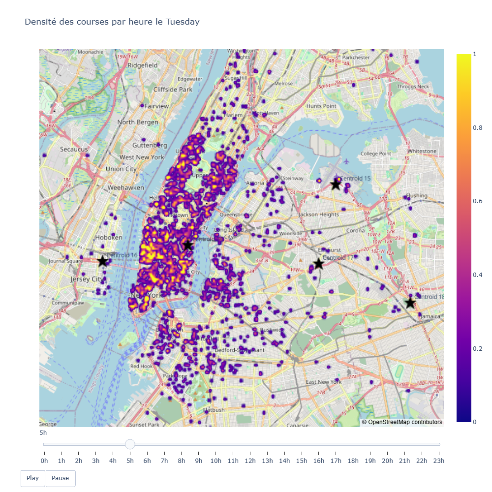
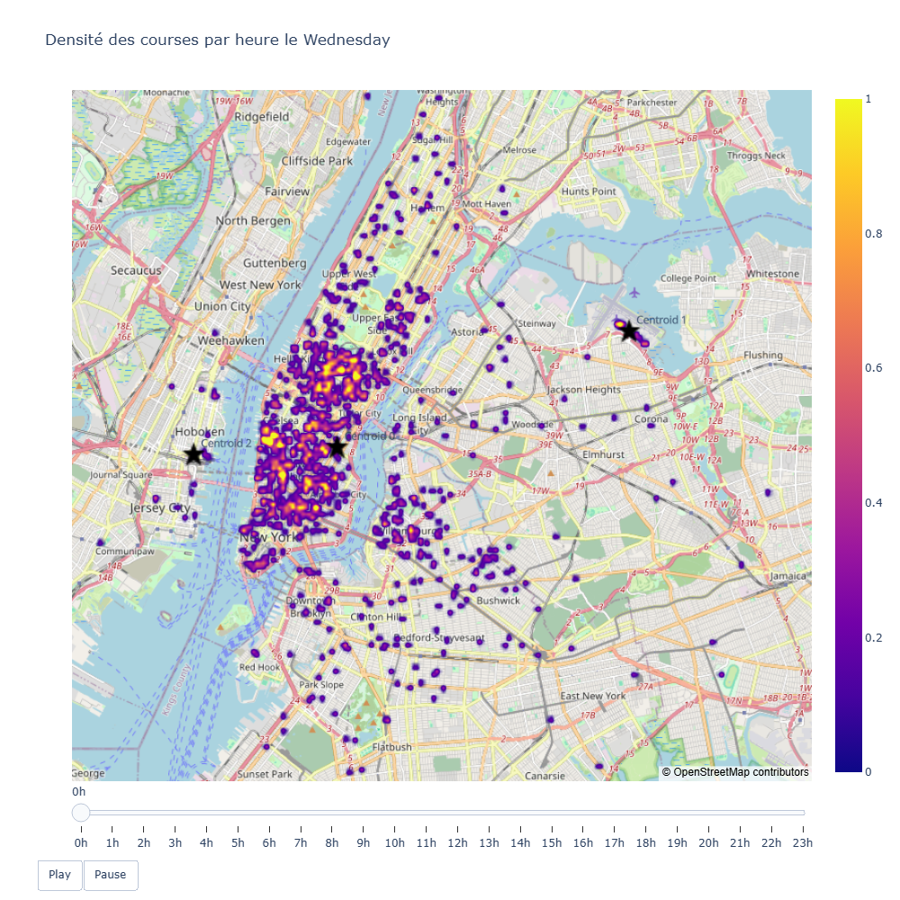
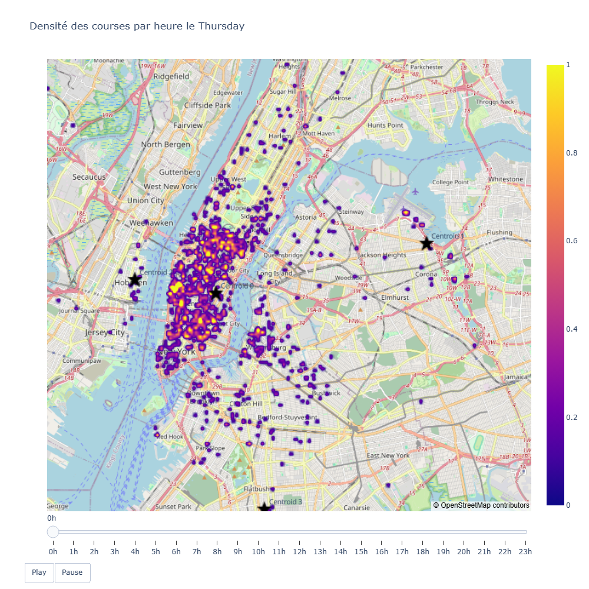
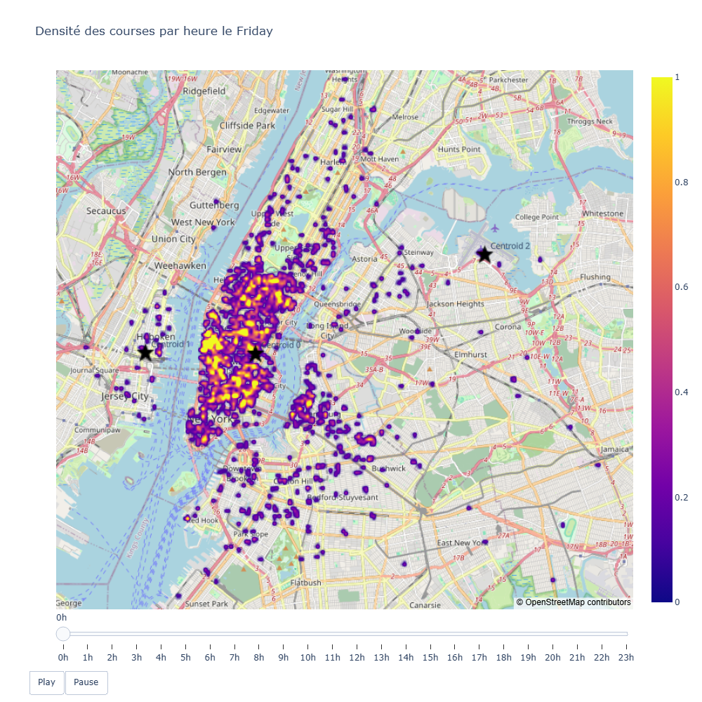
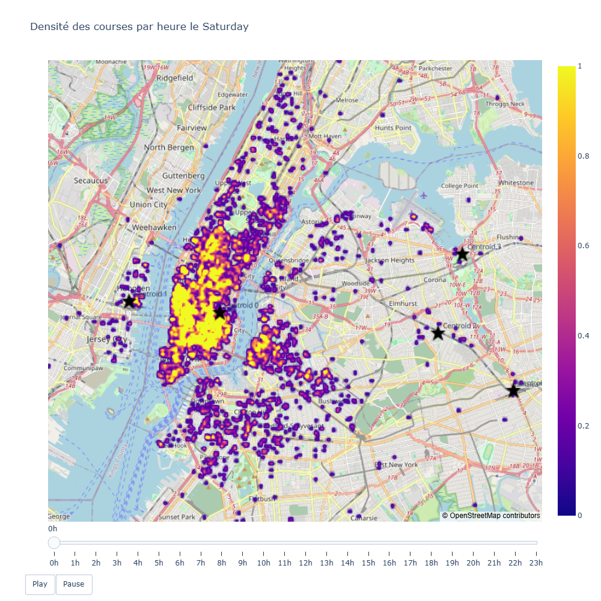
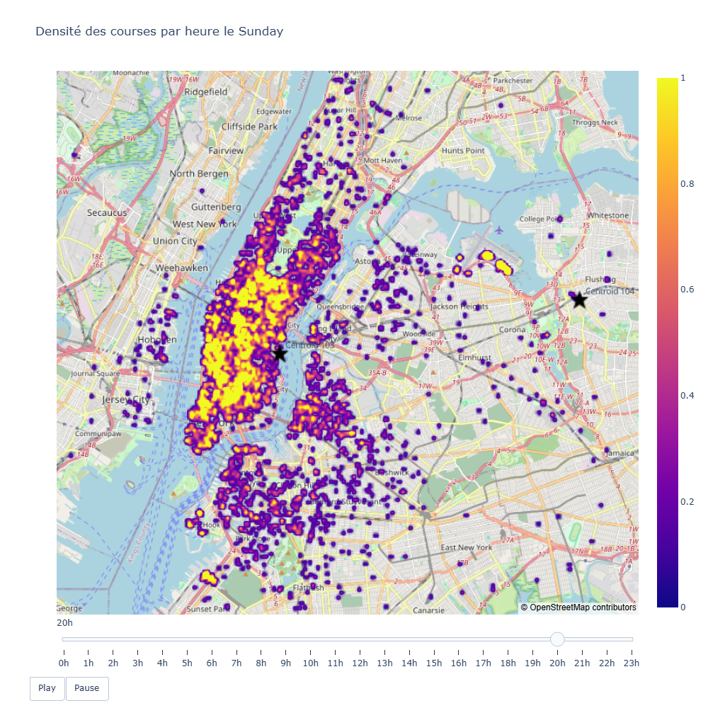

# Rappel des graphiques produits

## Rides distribution

Carte de densité des courses le 4/09/2014:

## K-Means clustering

K-MEans clusters (K=5) du 9/04/2014 à 23h:

## DBSCAN clustering

Paramètres:
- Epsilon:  0.00027740495036501496
- min_samples: 6

DBSCAN cluster du 9/04/2014 à 23h:

## Généralisation

DBSCAN clusters heure par heure pour chaque jour de la semaine

### Lundi 18h

### Mardi 05h

### Mercredi 00h

### Jeudi 00h

### Vendredi 00h

### Samedi 00h

### Dimanche 20h

