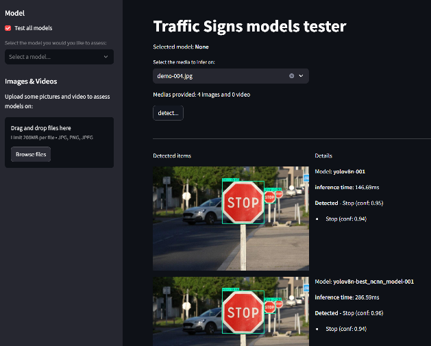
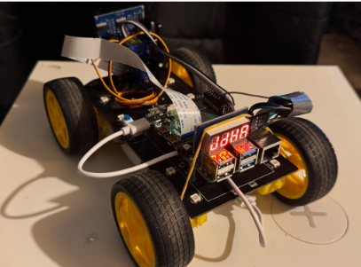
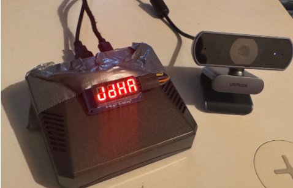

# Projet final: Traffic signs detection
## Présentation

Le but de se projet et de se confronter aux problèmatique de computer vision sur des systèmes légers et/ou autonomes.
Pour ce faire la problèmatique de reconnaissance de panneaux de signalisation a été retenues, avec un deploiement sur plateforme Raspberry Pi

## Objectif :

Déploiement de modèle de détection de panneaux de limitation de vitesse sur un Raspberry Pi avec deux cibles applicatives :
* Mini robot roulant
* Tableau de bord de voiture

## Implémentation :
### Modèles

Deux modèles on pu être testé avec succés:
1. "Yolo11" nano (2.6M) avec un custom dataset: [README](models/yolo/README.md)
2. Modèle custom: [README](models/cnn_custom/README.md)

### Applications

- [perf_bench](apps/perf_bench/README.md) : une application streamlit de preview des résultats de detection des différents modèles testés [live preview](https://pikaboum-traffic-signs-detector.hf.space/)

- [mini_robot_controller](apps/mini_robot_controller/README.md) : modules de pilotage avec détection de panneaux du mini robot roulant

- [car_onboard_display](apps/car_onboard_display/README.md) : modules de détection de panneaux sur un boitier destiné au tableau de bord de voiture

### Presentation

- [Powerpoint du projet Traffic signs detection](https://1drv.ms/p/c/e238927bf76c9315/EcxPhxIKZgdIvE11h4UiwMwBj4bSx2KI-sYpl35EmurGSw?e=emqCcS)
- Vidéos de démo:
  - [Indoor test - 1](https://youtu.be/eeSsdLOfbGk)
  - [Indoor test - 2](https://youtu.be/QkKUhP2VTDI)
  - [Outdoor test - 1](https://youtu.be/3sWtlqiuFo8)
  - [Outdoor test - 2](https://youtu.be/3sWtlqiuFo8)
  - [Yolo training vidéo](https://youtu.be/jnORLxcgAQE)

